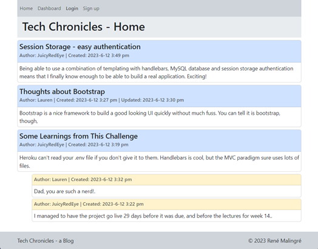
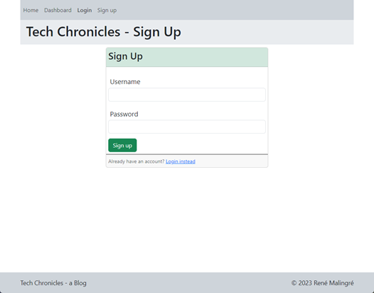
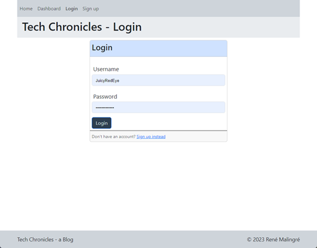
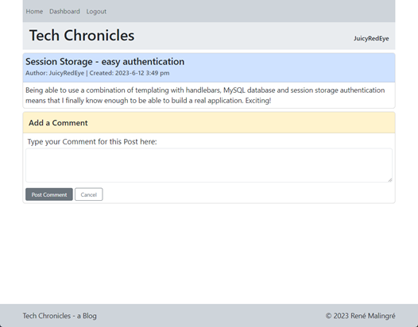
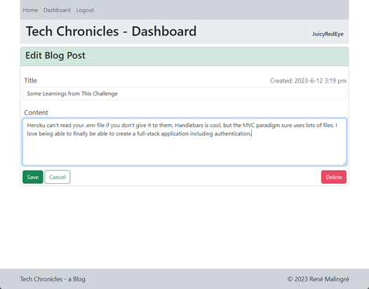

# Tech-Chronicles

 [](https://opensource.org/licenses/MIT)

A tech blog built using the MVC paradigm on a Node/Express/MySQL/Sequelize/Handlebars stack

## Description

This is a full-stack web log application that allows registered users to create, update and delete posts, and to attach comments to any posts on the site. The application uses a web interface built with Bootstrap, on an node.js express.js/MySQL/sequelize/handlebars backend. It uses connect-session-sequelize and express-session for user authentication. The application is deployed on Heroku and uses JawsDB for the MySQL database.

## Table of Contents

- [Technologies Used](#technologies-used)
- [Installation](#installation)
- [Usage](#usage)
- [Live Application](#live-application)
- [Credits](#credits)
- [License](#license)
- [Contributing](#contributing)
- [Questions](#questions)

## Technologies Used

- JavaScript programming language
- Node.js runtime environment
- MySQL database
- express.js npm package for creating the server
- mysql2 npm package for connecting to MySQL database
- sequelize npm package for modeling and mapping MySQL database to JavaScript
- Connect-session-sequelize npm package for storing session data in MySQL
- express-handlebars npm package for creating the HTML templates
- Bootstrap CSS framework for styling the front end
- bcrypt npm package for hashing passwords
  
## Installation

### Setup on your machine

It is live on Heroku at the link below. To load it on your own machine for your own purposes, fork or copy the repository to your own machine. To install the necessary dependencies, run the following command in the terminal:
  
```bash
npm i
```

You must have MySQL installed on your machine or have access to a remote MySQL install.  Create a .env file in the root directory of the application.  Add the following lines to the .env file, replacing the values with your own, and other values as required for your MySQL installation:

```bash
DB_USER='your MySQL username'
DB_PASSWORD='your MySQL password'
DB_NAME='your custom database name'
```

### Creating the database

To create the database, open the terminal and navigate to the 'db' directory where you copied the repository. Open schema.sql in your preferred editor and update the database name to match the one you specified in the .env file.

Run the following command to open the MySQL shell:

```bash
mysql -u root -p
```

Enter your MySQL password when prompted.  Then run the following command to create the database:

```bash
source schema.sql
```

### Creating the database tables and relationships

To create the tables and relationships prior to starting the application server, run the following command in the terminal from the root directory of the application:

```bash
npm run seed
```

The server will generate the tables on startup if they do not already exist anyway, so this step is optional.

### Starting the server

To start the server, run the following command in the terminal from the root directory of the application:

```bash
npm run start
```

## Usage

Navigate to [http://localhost:3001/](http://localhost:3001/) in your browser to access the application.

1. **First-time visit:** On first access, you'll see the homepage displaying any existing blog posts and their comments. Links for the homepage, dashboard, login and sign up options are presented.



2. **Accessing the homepage:** Click the homepage link to return to the homepage at any time.

3. **Accessing other sections:** Click on any other navigation links to trigger a prompt to sign up or log in.

4. **Signing up:** Select the sign-up option to create an account. Enter a username and password.



5. **Returning to the site:** On subsequent visits, select the sign-in option and input your username and password to access the site.



6. **Navigating as a logged-in user:** Once logged in, links for the homepage, dashboard, and logout option become available.

7. **Reading blog posts:** Click the homepage link to view existing blog posts, complete with title, date created, date updated if they have been edited, and the creator’s username. You will also see any comments that are attached to the individual posts.

8. **Interacting with blog posts:** Click on a blog post to view it on its own with all its details and leave a comment if desired.



9. **Commenting on posts:** Type a comment and click the save button to save and display it under the post.

10. **Using the dashboard:** Access the dashboard to view your own blog posts and create new ones.

11. **Creating a blog post:** Click the "New Post" link or button from within the Dashboard, and enter a title and content for your post.

12. **Managing your blog posts:** Click on any of your posts in the dashboard to update or delete them.



13. **Logging out:** Use the logout option to sign out when finished.

14. **After a period of inactivity:** If idle for a set period, you'll be prompted to log in again before adding, updating, or deleting posts.

## Live Application

A running instance of the application can be viewed [here on Heroku](https://shielded-earth-15516.herokuapp.com/).

## Credits

JavaScript runtime: [Node.js](https://nodejs.org/en/)

MySQL database: [MySQL](https://www.mysql.com/)

MySQL2 npm package: [mysql2](https://www.npmjs.com/package/mysql2)

Sequelize ORM: [sequelize](https://sequelize.org/)

Connect-session-sequelize npm package: [connect-session-sequelize](https://www.npmjs.com/package/connect-session-sequelize)

Express-session npm package: [express-session](https://www.npmjs.com/package/express-session)

Express.js framework: [express.js](https://expressjs.com/)

Express-handlebars npm package: [express-handlebars](https://www.npmjs.com/package/express-handlebars)

Bootstrap CSS framework: [Bootstrap](https://getbootstrap.com/)

bcrypt npm package: [bcrypt](https://www.npmjs.com/package/bcrypt)

## License
  
This repository is licensed under the [MIT](https://opensource.org/licenses/MIT) license.
  
## Contributing
  
Contributions to this project will not be accepted, as this project is an assessment piece for a coding course, and it must be the project author's own work. However, feel free to fork the repository and make your own changes.
  
## Questions
  
If you have any questions about the repository, open an issue or contact me directly at: [rene.malingre@gmail.com](mailto:rene.malingre@gmail.com).
  
You can find more of my work at [GitHub](https://github.com/ReneMalingre).
